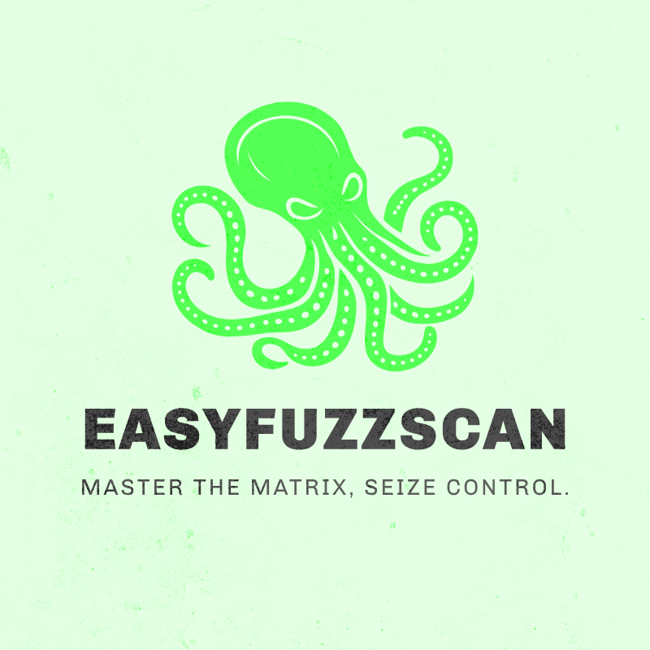
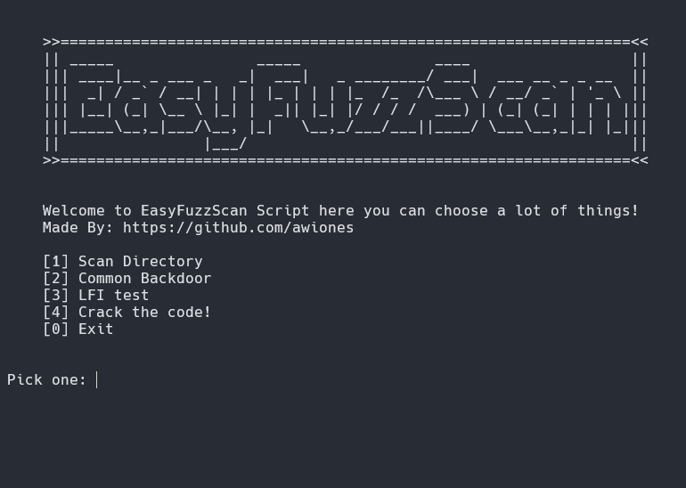

# EasyFuzzScan - Vulnerability Scanning Module

<p align="center">

</p>

---

## Introduction to EasyFuzzScan

Welcome to EasyFuzzScan! This Python script is designed to help you identify potential security vulnerabilities in websites through various scanning techniques.

## Features:

* **Directory Scanning:**
   * Scans a list of directories to check their availability on the target website.
   * Provides feedback on whether each directory is accessible or results in a 404 error.
   * Includes a playful message if a directory suddenly returns a 404 status, indicating a potential block.

* **Common Backdoor Testing:** 
   * Tests a set of known backdoor paths to check for vulnerabilities in the target website. 
   * Reports back on the accessibility of these paths, including a message if a 404 error is encountered.

* **LFI Fuzzing:**
   * The Local File Inclusion (LFI) fuzzing function tests various file paths in the target URL to detect potential file inclusion vulnerabilities.
   * Provides status updates and handles errors gracefully.
   * Gives a specific message if a 404 error is encountered.

## Usage Instructions:

### Setup:

<div align="center">
<table border=0 style="border: 1.2px solid #c6c6c6 !important; border-spacing: 2px; width: auto !important;">
<tr><td valign=top style="border: 1.2px solid #c6c6c6 !important; padding: 2px !important;">
<div align=center valign=top>
</div>
</a></td></tr><tr></tr></table></div>

1. Install the file:

   ```bash
   git clone https://github.com/awiones/EasyFuzzScan.git
   cd EasyFuzzScan
   pip install -r requirements.txt
   python3 run.py
   ```
## Contributing

Contributions are welcome! If you have suggestions, improvements, or bug fixes, please submit a pull request or open an issue.

- **Fork the Repository**: Create a personal copy of the repository on GitHub.
- **Make Changes**: Implement your changes and test them locally.
- **Submit a Pull Request**: Describe your changes and submit a pull request for review.

## License

This project is licensed under the MIT License. See the [LICENSE](LICENSE) file for details.

---

Made with ❤️ by Awiones
